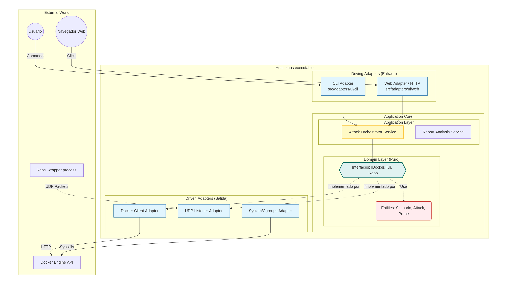

# CHAOS: Resilience Validation Platform

CHAOS is a software engineering tool developed in C++23, designed for deterministic robustness verification in containerized applications.

Unlike distributed chaos orchestrators, CHAOS specializes in unit validation of components. The system interacts directly with the Linux kernel (using Cgroups v2 and Network Namespaces) to subject a specific container to degraded execution conditions.

## Technical Objectives

- Fault Isolation: Identify how a single process handles critical resource scarcity (CPU/RAM).
- Recovery Validation: Empirically verify reconnection and failover mechanisms in the face of induced network latencies or outages.
- Stress Monitoring: Provide real-time metrics on the behavior of the “victim” under controlled stress scenarios.

## Architecture Overview

